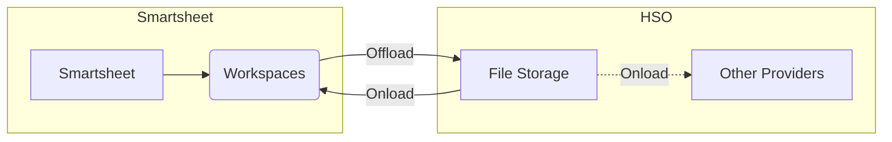
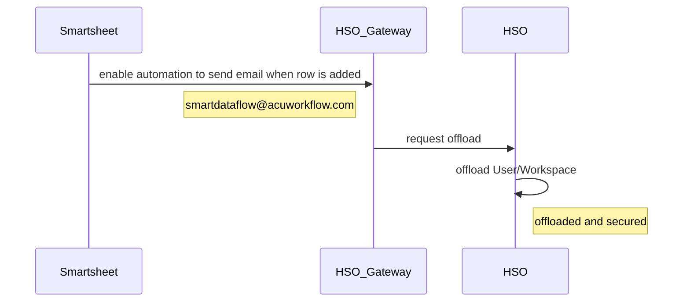

# HSO: High Speed Offloader/Onloader for Smartsheet
The data movement solution for efficiently moving bulk data in and out of Smartsheet, effortlessly overcoming the platform's inherent 100-item limitation.

When used in conjunction with SmartBackup, HSO increases accuracy, mitigates risks, and helps with compliance requirements. In stand-alone mode, HSO excels as a bulk data migrator, take-on engine, or solution duplicator.




## Features

1. **Multi-Region Connectivity** Moves data across different Smartsheet regions (US, EU, APJ, GOV), something [not possible](https://help.smartsheet.com/articles/2482447-migrating-data-across-regions) natively from Smartsheet
2. **Intra Region** Data can be copied/moved based on Workspace/s or User/s or Account, something not possible using Smartsheet DataShuttle which only operate at sheet level.
3. **Flexible Data Selection** Advanced filtering options allow users to select specific sheets, folders, users, or complete account for migration based on criteria like file User, Workspace or sheet naming.
5. **Folder hierarchies** HSO retain folder hierarchies
6. **Onload to** HSO can onload to Smartsheet or most of the Industry acceptable solutions
7. **Automation and scheduling** Automates workflows to move data when it make sense, reducing manual intervention. Offloader/Onloader can be run on-demand or scheduled.  In addition offloader can be triggered by Smartsheet or Enterprise Events.
8. **Metadata Preservation** Captures and restores Smartsheet structures (Folder hierarchies, names, etc) and retain knowledge of most attributes.
9. **Data Integrity & Security** Uses checksum algorithms (MD5, SHA256) to verify file transfers and supports encrypted transport and authentication.  Offloaded data under your control.


## When to use

| Use Case      | Description   |
| ------------- |:-------------:|
| Data Center Migration | HSO enables organizations to migrate Account data between Smartsheet Regions, overcoming a challenge that is nearly impossible to address within the current Smartsheet environment. | 
| Offline Backups | When used together with SmartBackup, HSO can provide complete, full offline backup copies of all your Smartsheet data, for long-term storage in a secure offline location, while SmartBackup backs up and exports your recently used sheets and dashboards. | 
| Daily Solution copies | Leverage HSO to generate daily snapshot copies and offloads of your critical projects and solutions. This feature ensures comprehensive audit tracking and facilitates seamless data restoration when needed. | 
| Move large data in/out of Smartsheet |Utilize HSO to seamlessly offload critical data for a range of purposes, including Disaster Recovery Planning (DRP), data protection, enrichment, seed-feed processes, and attachment relocation. | 
| Bulk Data Take-on | Easily onload bulk data from other systems and Smartsheet alternative platforms, including ClickUp, Monday.com, and Asana, for streamlined integration and improved workflow continuity. | 
| Solution stepping | Schedule version roll-on/roll-off processes on a nightly or weekly basis. Enable sandbox seeding to provide anonymized and de-sensitized data for testing and development. Support project retirements and data freezing for long-term preservation. | 
| Regulatory compliance | Use HSO to streamline regulatory record-keeping and ensure compliance with applicable standards. HSO supports regulations such as DORA (Digital Operational Resilience Act) in the EU, helping you meet your organization's compliance requirements with ease. | 
| Blueprinting | HHSO enables the effortless creation of new instances for key Projects, Solutions, or Sheet Collections in Smartsheet. Leverage predefined templates to ensure quick and efficient creating. | 

## Triggered Events
HSO Offloader can be triggered to offload:
>   1. Any **User** complete with all its associated workspaces, folders, sheets and attachments
>   2. Any **Workspace** with all its associated folders, sheets and attachments

> [!NOTE]
> For Triggered Events to work, the following must be adhered to:
> 1. HSO must be up and running, using V7.0 Beta or later
> 2. HSO must be configured with the appropriate SysAdmin Token and Region thus connecting to the Smartsheet Region where you want to offload from


### Smartsheet events
Offload can be triggered using Smartsheet automations using events such as

1. trigger offload when new rows are added or changed
2. trigger offload when a user is removed from a group
3. trigger offload on a schedule

> [!NOTE]
> When using Zapier and others offering WebHook facilities one can access a lot more SmartSheet events.
> For example one can trigger event when backup-is-requested
> (Current list of Events)[https://developers.smartsheet.com/api/smartsheet/event-types]


### External events
External events outside Smartsheet or so-called Enterprise events can also trigger the offload process.  Optionally these could also be facilitated by Automation solutions such as Zapier, Make, Power-Automate and others.  Some examples
1.  trigger when a user resign
2.  trigger when department is re-located

### How does triggered events work?


Any event must send email to the HSO Email gateway to trigger the offload. The flow must construct an email with a specific subject line and send it to the HSO Email gateway at ***smartdataflow@acuworkflow.com*** This address may change in future.

#### Email Format
Email message body is ignored, but email subject line must follow the following syntax

##### When signaling the offload of a complete User
   > ***offload/sharedsecret/email*** or
   > ***offload/sharedsecret/email/user***
---
```
      - slashes must subdivide the info without any spaces as shown
      - offload must be spelled as shown
      - sharedsecret is the allocated license code from HSO
      - email is the email address of the Smartsheet user 
      - user can optionally be supplied and must be spelled as shown
```
Example ***offload/87f2243/janie.adams@acme.com***
       
##### When signaling the offload of a Workspace
   > ***offload/sharedsecret/email/workspace/workspaceid***
---
```
- slashes must subdivide the info without any spaces as shown
- offload must be spelled as shown
- sharedsecret is the allocated license code from HSO
- email is the email address of the Smartsheet user 
- workspace must be spelled as shown
- workspaceid is the Smartsheet id for the workspace
```
Example ***offload/87f2243/janie.adams@acme.com/workspace/98766628356786***

> [!NOTE]
> The sharedsecret is the allocated license code shared with the Smartsheet Administrator when installing HSO.
> If mislaid by the Administrator, AcuWorkflow support can be contacted for the value.  Otherwise the HSO
> installation subfolder /data could be browsed and an encrypted file with the name lic.xxxxxx.lic should be visible.
> xxxxxx is the license code to be use. 


