# HSO: High Speed Offloader/Onloader for Smartsheet
The data movement solution for efficiently moving bulk data in and out of Smartsheet, effortlessly overcoming the platform's inherent 100-item limitation.

This is interim documentation highlighting the new features in **Version 7.2.0** Existing documentation is available from [AcuWorkflow](https://hso.acuworkflow.com)
[Docs](https://acuworkflow.gitbook.io/acuworkflow-hso-documentation/reference-guide)

When used in conjunction with SmartBackup, HSO increases accuracy, mitigates risks, and helps with compliance requirements. In stand-alone mode, HSO excels as a bulk data migrator, take-on engine, or solution duplicator.

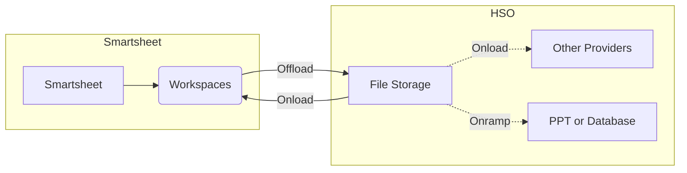
```mermaid
flowchart LR
    subgraph Smartsheet
    A[Smartsheet] --> B(Workspaces)
    end
    B --> |Offload| D[File Storage]
    D --> |Onload| B
    subgraph HSO
    D -.-> |Onload| E[Other Providers]
    D -.-> |Onramp| F[PPT or Database]
    end
```
## Key new features in V7.2.0

1. **Enhanced Capabilities** Enhancements and Improvements
   - Offload Reports Can now also offload **Reports**
   - When onloading to Other, support parquet file formats in addition to Excel and CSV
   - Number of improvements to the UI and stability 
3. [**Event based offloading**](#Event-based-offloading) All workspaces or a specific workspace can be offloaded based on a Smartsheet or Enterprise event.
4. [**Onramp**](#OnRamp) Transform offloaded sheets into Powerpoint or Database.
5. [**OnLoad to Other**](#Onload-to-other) Though available in current release added more integrations and formats.

    | Integrations | Comments |
    | ------------- | ------------- |
    | 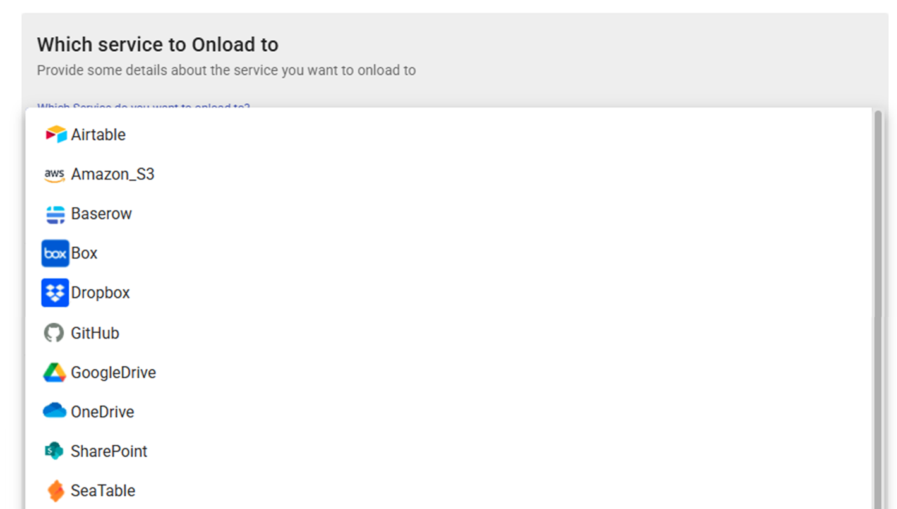 | 10+ Tested Integrations.  Added ability to transform offloaded Smartsheet sheets automatically to CSV becuase it is the preferred format for many other providers |


## Platform Capabilities

1. **Multi-Region Connectivity** Moves data across different Smartsheet regions (US, EU, APJ, GOV), something [not possible](https://help.smartsheet.com/articles/2482447-migrating-data-across-regions) natively from Smartsheet
2. **Bulk Data Transfer** Data can be copied/moved based on Workspace/s, User/s or Account, something not possible using Smartsheet DataShuttle which only operate at sheet level.
3. **Flexible Data Selection** Advanced filtering options allow users to select specific sheets, folders, users, or complete account for migration based on criteria like file User, Workspace or sheet naming.
5. **Folder hierarchies** HSO retain folder hierarchies
6. **Onload to** HSO can onload to Smartsheet or most of the Industry acceptable solutions, such as SeaTable, AirTable, and most Cloud providers (Google, Box, OneDrive etc).
7. **Automation and scheduling** Automates workflows to move data when it make sense, reducing manual intervention. Offloader/Onloader can be run on-demand or scheduled.  In addition offloader can be triggered by Smartsheet or Enterprise Events.
8. **Metadata Preservation** Captures and restores Smartsheet structures (Folder hierarchies, names, etc) and retain knowledge of most attributes.
9. **Data Integrity & Security** Uses checksum algorithms (MD5, SHA256) to verify file transfers and supports encrypted transport and authentication.  Offloaded data under your control.
10. **OnRamp** Should the need arise, offloaded sheets can be transformed into PPT-Decks or Database-Tables, a process called **onramp**.
    


## When to use

| Use Case      | Description   |
| ------------- |:-------------:|
| Data Center Migration | HSO enables organizations to migrate Account data between Smartsheet Regions, overcoming a challenge that is nearly impossible to address within the current Smartsheet environment. | 
| Offline Backups | When used together with SmartBackup, HSO can provide complete, full offline backup copies of all your Smartsheet data, for long-term storage in a secure offline location, while SmartBackup backs up and exports your recently used sheets and dashboards. | 
| Daily Solution copies | Leverage HSO to generate daily snapshot copies and offloads of your critical projects and solutions. This feature ensures comprehensive audit tracking and facilitates seamless data restoration when needed. | 
| Move large data in/out of Smartsheet |Utilize HSO to seamlessly offload critical data for a range of purposes, including Disaster Recovery Planning (DRP), data protection, enrichment, seed-feed processes, and attachment relocation. | 
| Bulk Data Take-on | Easily onload bulk data from other systems and Smartsheet alternative platforms, including ClickUp, Monday.com, and Asana, for streamlined integration and improved workflow continuity. | 
| Solution stepping | Schedule version roll-on/roll-off processes on a nightly or weekly basis. Enable sandbox seeding to provide anonymized and de-sensitized data for testing and development. Support project retirements and data freezing for long-term preservation. | 
| Regulatory compliance | Use HSO to streamline regulatory record-keeping and ensure compliance with applicable standards. HSO supports regulations such as DORA (Digital Operational Resilience Act) in the EU, helping you meet your organization's compliance requirements with ease. | 
| Blueprinting | HHSO enables the effortless creation of new instances for key Projects, Solutions, or Sheet Collections in Smartsheet. Leverage predefined templates to ensure quick and efficient creating. | 

## Event based offloading
HSO Offloader can be triggered to offload:
>   1. Any **User** complete with all its associated workspaces, folders, sheets and attachments
>   2. Any **Workspace** with all its associated folders, sheets and attachments

> [!NOTE]
> For Triggered Events to work, the following must be adhered to:
> 1. HSO must be up and running, using V7.0 Beta or later
> 2. HSO must be configured with the appropriate SysAdmin Token and Region thus connecting to the Smartsheet Region where you want to offload from


### Smartsheet events
Offload can be triggered using Smartsheet automations using events such as

1. trigger offload when new rows are added or changed
2. trigger offload when a user is removed from a group
3. trigger offload on a schedule

> [!NOTE]
> When using Zapier and others offering WebHook facilities one can access a lot more SmartSheet events.
> For example one can trigger event when backup-is-requested
> (Current list of Events)[https://developers.smartsheet.com/api/smartsheet/event-types]


### External events
External events outside Smartsheet or so-called Enterprise events can also trigger the offload process.  Optionally these could also be facilitated by Automation solutions such as Zapier, Make, Power-Automate and others.  Some examples
1.  trigger when a user resign
2.  trigger when department is re-located

### How does triggered events work?
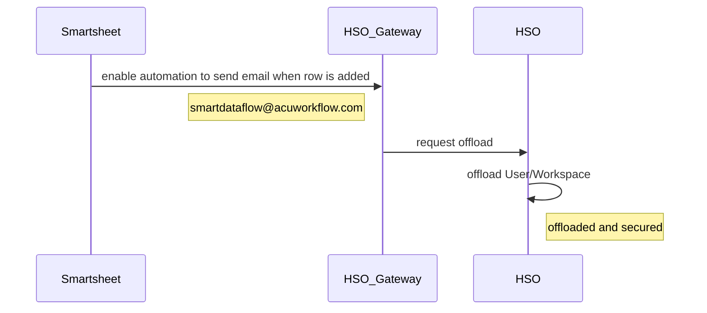
```mermaid
sequenceDiagram
    participant Smartsheet
    participant HSO_Gateway
    participant HSO
    Smartsheet->>HSO_Gateway: enable automation to send email when row is added
    Note left of HSO_Gateway: smartdataflow@acuworkflow.com
    HSO_Gateway->>HSO: request offload
    HSO->>HSO: offload User/Workspace
    Note right of HSO: offloaded and secured
```

Any event must send email to the HSO Email gateway to trigger the offload. The flow must construct an email with a specific subject line and send it to the HSO Email gateway at ***smartdataflow@acuworkflow.com*** This address may change in future.

#### Email Format
Email message body is ignored, but email subject line must follow the following syntax

##### When signaling the offload of a complete User
   > ***offload/sharedsecret/email*** or
   > ***offload/sharedsecret/email/user***
---
```
      - slashes must subdivide the info without any spaces as shown
      - offload must be spelled as shown
      - sharedsecret is the allocated license code from HSO
      - email is the email address of the Smartsheet user 
      - user can optionally be supplied and must be spelled as shown
```
Example ***offload/87f2243/janie.adams@acme.com***
       
##### When signaling the offload of a Workspace
   > ***offload/sharedsecret/email/workspace/workspaceid***
---
```
- slashes must subdivide the info without any spaces as shown
- offload must be spelled as shown
- sharedsecret is the allocated license code from HSO
- email is the email address of the Smartsheet user 
- workspace must be spelled as shown
- workspaceid is the Smartsheet id for the workspace
```
Example ***offload/87f2243/janie.adams@acme.com/workspace/98766628356786***

> [!NOTE]
> The sharedsecret is the allocated license code shared with the Smartsheet Administrator when installing HSO.
> If mislaid by the Administrator, AcuWorkflow support can be contacted for the value.  Otherwise the shared secret 
> code is visible bottom left in the console. 

## OnRamp

OnRamp is the process whereby sheets can be turned into [Powerpoint](#OnRamp-to-Powerpoint) files or [Databases](#OnRamp-to-Database)

1. Select Workspace you are interested in.
2. Click Data Transfer button which will create a configuration file later to be used by subsequent onload/onramp processes
3. Click OnRamp button which will now be visible.

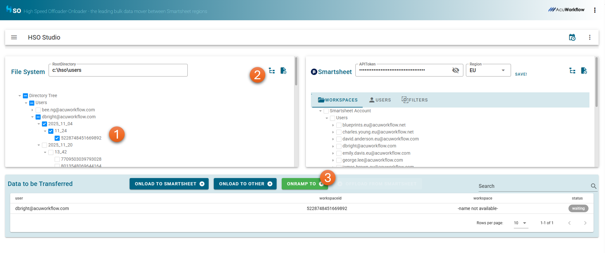

You will be guided via a 4 step wizard process.  Please follow happy path and supply values that is needed. Offering still brittle.
Choose between Powerpoint and Database.

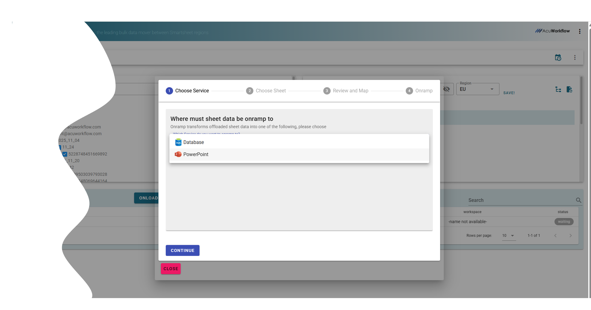

#### OnRamp to Powerpoint

Capability functions like a traditional mail-merge.  Each sheet row will generate a new slide based on the designated blueprint slide within chosen Template.  Row column values will be inserted if the column name is the same as the shape name.


Actually quite simple.
1. Create or choose Powerpoint deck with style appropriate to your purpose.  You may choose/modify supplied sample Templates.
2. Create a blueprint slide within that form the basis of the mail-merge. Typically this is a graphic style which conveys the info you require.
3. One now must change the blueprint shape names to the sheet column names, so come mail-merge time the right value is inserted into the generated slide.  One does this by picking the select object pane
4. Rename shape names to correspond with column names whose values you want to appear.  Easiest is to click on the shape and see what name is highlighted then rename it.

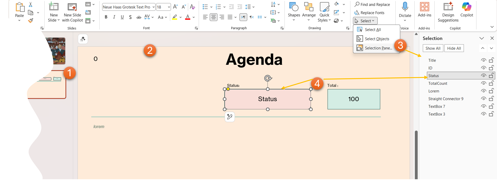

##### Step 1 Choose Service

1. Select Powerpoint from Dropdown
2. Select sample Template or any Template file you have created
3. Input the blueprint slide number.  This is the slide that will be mail-merged for each sheet row
4. Provide path name or accept default where generated Powerput will be stored
5. Provide a name for the output Powerpoint file

 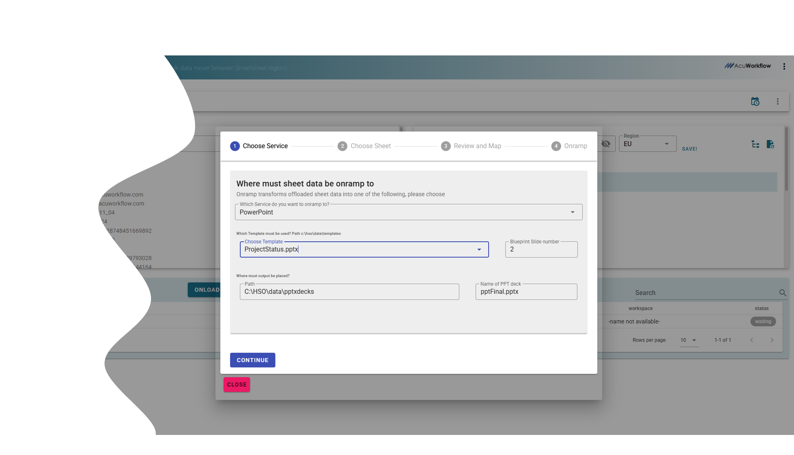
 
##### Step 2 Choose Sheet

1. All the offloaded sheets in the selected Workspace will be displayed and one must be selected. 
2. This will become the input source sheet driving the mail-merge

 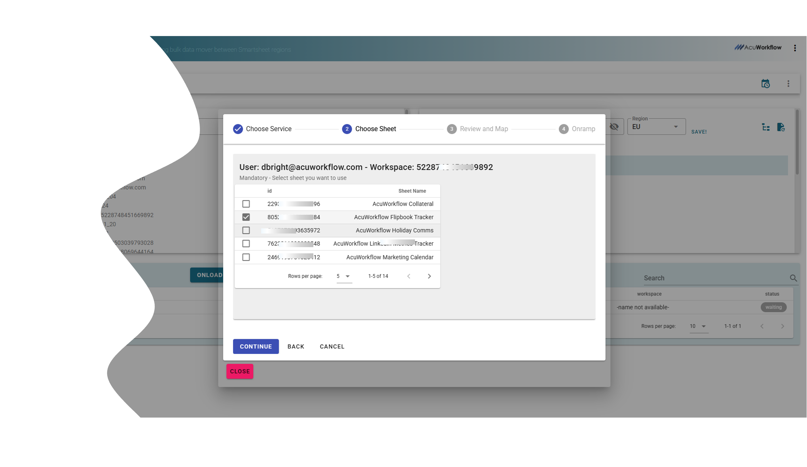
 
##### Step 3 Mapping

1. Ideally this is where source to target mappings take place.
2. It will display all the source sheet column names
3. Onramping to Powerpoint means one will have to rename some shape-names in the Template blueprint slide with names corresponding to these column values

 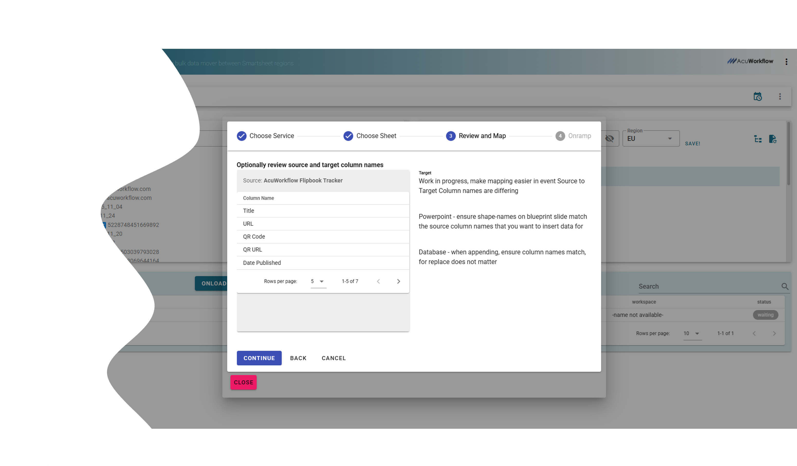

 ##### Step 4 Transform

1. Here one can do final review and do the transform to generate the Powerpoint deck
2. Click on results which will open Windows Explorer view to where generated decks are stored
3. Open the Powerfpoint and refine.

 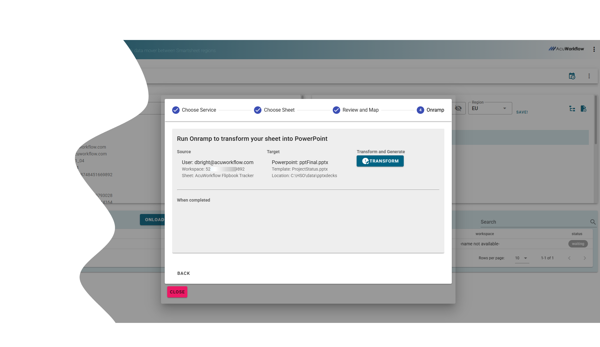

 #### OnRamp to Database

Capability will take chosen sheet and based on choices create or update a new database with a new or appended database table.

Once can be quite creative in creating a new Database with a new table and then keep on appending same table to contain multiple sheets with like column structures 

 

The rest of the steps similar to Powerpoint conversion.  

> [!NOTE]
> In Step 4 Transform a link is provided to a browser based SQL App from where the Database can be securely browsed or manipulated. 
> Optionally one can use many of the free or paid for SQL Workbenches to manipulate the database

### PowerPoint Worked Example
*With business conversations mostly supported by PowerPoint it becomes quite a challenge to do a strategic Programme review with all the details in Smartsheet.*  Worked example speak to the need to Equip the Executive with a rich PowerPoint Pack containing current details of companies strategic programmes.

<details>

<summary>Create rich PowerPoint Pack from Smartsheet sheet data</summary>

#### Generate Powerpoint Pack

- Once off design a PowerPoint Template with a blueprint slide capturing the essence of what must be reported and make sense for an executive conversation.
- Run a quarterly offload of the Workspace containing all Programme transformation details.
- Run PowerPoint Offramp to create basic Excutive deck with all the relevant sheet details in the generated slides
- Review and add appropriate input before publishing the pack.

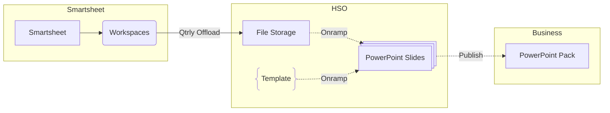
```mermaid
flowchart LR
    subgraph Smartsheet
    A[Smartsheet] --> B(Workspaces)
    end
    B --> |Qtrly Offload| D[File Storage]
    subgraph HSO
    D -.-> |Onramp| E@{ shape: processes, label: "Powerpoint Slides" }
    F@{ shape: braces, label: "Template" } -.-> |Onramp| E@{ shape: processes, label: "PowerPoint Slides" }
    end
    subgraph Business
    E -.-> |Publish| G[PowerPoint Pack]
    end
```

</details>

### Database Worked Example
*Need for analysing million plus rows*  

<details>

<summary>Create Database from Smartsheet sheet data</summary>

#### Database

- blah blah blah


</details>


